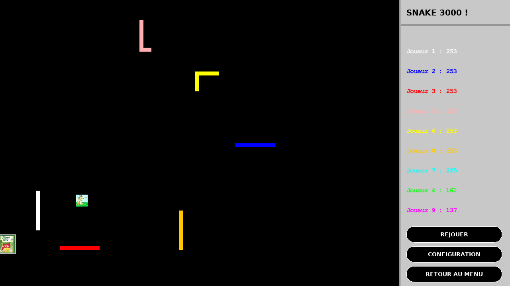

# *Snake3000*

*Coding Night* du 21/10/2017

## Avertissement liminaire

Ce dépôt n'est plus maintenu et subsiste uniquement en tant qu'archive.

Les jeux suivants sont désormais développés au sein du dépôt [tgd-projet_2018](https://github.com/TeleGD/tgd-projet_2018) :

* [tgd-snake3000/snake3000](https://github.com/TeleGD/tgd-snake3000/tree/master/src/games/snake3000) -> [tgd-projet_2018/snake](https://github.com/TeleGD/tgd-projet_2018/tree/master/src/games/snake)

Les jeux suivants ne disposent plus d'aucun support connu :

* [tgd-snake3000/snake3001](https://github.com/TeleGD/tgd-snake3000/tree/master/src/games/snake3001)
